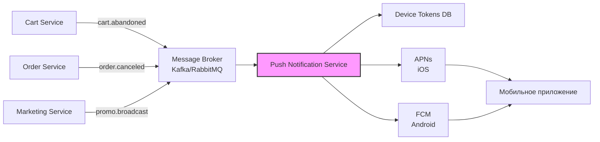

# Тестовое задание: Системный аналитик

**Интернет-магазин "Петрушка Зелёная"**

---

## Задание 1. Анализ требований к функционалу "Корзина"

### 1.1. Логические противоречия и недочёты в ТЗ

| № | Пункт ТЗ | Описание проблемы |
|---|----------|-------------------|
| 1 | 1 vs 9 | П.1: "от 1 до 10 единиц одного товара". П.9: "уменьшает количество до 0, товар удаляется". Противоречие: нельзя иметь 0 единиц, если минимум 1. |
| 2 | 2 vs 9 | П.2: "изменить количество не менее, чем до 1-го". П.9 разрешает до 0. Прямое противоречие в диапазоне количества. |
| 3 | 3 vs 4 | Максимум 5 товаров vs суммарно 20 штук. Неясно: приоритет ограничения и какое сообщение показывать при нарушении. |
| 4 | 6 | Одно сообщение "Лимит корзины превышен" на все случаи (10 единиц товара, 5 уникальных, 20 суммарно). Пользователь не понимает, что исправить. |
| 5 | 7 vs 13 | П.7: "цена фиксируется при добавлении и не меняется". П.13: "если цена изменилась, обновить в корзине у всех". Прямое противоречие. |
| 6 | 8 | "Общая стоимость позиции" – не указано, по какой цене считать (фиксированной или актуальной). |
| 7 | 10–11 | "Реклама по утрам и вечерам будней". Неопределённые понятия: "утро/вечер" (часы, таймзона), влияет ли на лимиты товаров. |
| 8 | Нет | Отсутствует п.12 (технический недочёт нумерации). |
| 9 | Нет | Нет поведения для гостей (неавторизованных), недоступных товаров, валюты цен. |

### 1.2. Предложенная версия ТЗ (исправленная)

**Раздел ТЗ: Функционал корзины**

1. Пользователь может добавить в корзину от 1 до 10 единиц одного товара.
2. Пользователь может изменять количество товара в корзине в диапазоне от 1 до 10 единиц.
3. Для удаления товара из корзины используется отдельная кнопка "Удалить". Уменьшение количества до 0 не допускается.
4. В корзине может находиться не более 5 различных товаров.
5. Суммарное количество всех товаров в корзине не может превышать 20 штук.
6. При попытке превышения любого лимита корзины система показывает конкретное сообщение об ошибке:
   - "Нельзя добавить более 10 единиц одного товара" (п.1–2).
   - "Нельзя добавить более 5 разных товаров в корзину" (п.4).
   - "Суммарное количество товаров не может превышать 20" (п.5).
7. Цена товара фиксируется на момент добавления в корзину и не изменяется при изменениях цены в каталоге.
8. На странице корзины отображается список товаров, их количество, цена за единицу (зафиксированная на момент добавления), общая стоимость позиции (цена за единицу × количество). Общая сумма заказа = сумма всех позиций.
9. В корзине могут отображаться рекламные блоки, не учитываемые в ограничениях по количеству товаров.
10. Периоды показа рекламных блоков: будние дни 09:00–11:00 и 18:00–21:00 по таймзоне магазина (конфигурируется на бэкенде).
11. Корзина поддерживается для авторизованных пользователей (в БД) и гостей (в cookies/локальном хранилище, срок жизни – 30 дней).
12. Если товар удалён из каталога или снят с продажи, в корзине отображается уведомление "Товар недоступен", позиция исключается из общей суммы.

### 1.3. Уточняющие вопросы к заказчику

**По лимитам:**
- Какое ограничение приоритетнее при конфликте: по уникальным товарам (5) или по суммарному количеству (20)?
- Нужно ли подтверждение перед удалением товара кнопкой?

**По цене:**
- Фиксировать цену при добавлении или всегда использовать актуальную из каталога?
- Если цена выросла при оформлении заказа, как обрабатывать: доплата, отмена, предупреждение?

**По рекламе:**
- Что именно "утро" и "вечер" (конкретные часы)?
- Реклама обязательна только в эти периоды или может показываться и в другие?
- Рекламные блоки влияют на лимит товаров или независимы?

**По пользователям и edge cases:**
- Корзина для гостей: где хранить (cookies/localStorage), срок жизни?
- Что делать с позициями корзины, если товар недоступен (удалить автоматически или уведомить)?
- Валюта цен, формат отображения, правила округления общей суммы?

---

## Задание 2. REST API для экрана "Магазины партнёров"

```json
{
  "items": [
    {
      "id": "metro_1",
      "name": "МЕТРО",
      "logo_url": "https://cdn.petrushka-zelenaya.ru/partners/metro_logo.png",
      "working_hours": "Ближайшая доставка сегодня 21:00–23:00",
      "external_url": "https://metro.ru/app?ref=petrushka"
    },
    {
      "id": "ashan_1",
      "name": "Ашан",
      "logo_url": "https://cdn.petrushka-zelenaya.ru/partners/ashan_logo.png",
      "working_hours": "Ближайшая доставка сегодня 18:00–20:00",
      "external_url": "https://ashan.ru/app?ref=petrushka"
    },
    {
      "id": "vkusvill_1",
      "name": "ВкусВилл",
      "logo_url": "https://cdn.petrushka-zelenaya.ru/partners/vkusvill_logo.png",
      "working_hours": "Быстрая доставка от 20 до 60 минут",
      "external_url": "https://vkusvill.ru/app?ref=petrushka"
    },
    {
      "id": "viktoria_1",
      "name": "ВИКТОРИЯ",
      "logo_url": "https://cdn.petrushka-zelenaya.ru/partners/viktoria_logo.png",
      "working_hours": "Ближайшая доставка сегодня 17:00–19:00",
      "external_url": "https://viktoria.ru/app?ref=petrushka"
    }
  ],
  "meta": {
    "total": 4,
    "limit": 10,
    "offset": 0
  }
}
```

**Соответствие макету экрана:**

- name → название магазина (МЕТРО, Ашан и т.д.)

- logo_url → логотип в цветном квадрате

- working_hours → текст доставки под названием

- external_url → переход при клике по карточке на внешний ресурс партнёра

## Задание 3. Верхнеуровневая архитектура PUSH-уведомлений ##


### Компоненты системы



 ## Описание работы 
**1. Бизнес-микросервисы (Cart, Order, Marketing):**
   - Генерируют события при изменении состояний (заказ отменён, корзина заброшена более 30 минут, промо-акция).
    
   **2. Message Broker (Kafka/RabbitMQ):**
   - Надёжная очередь событий с поддержкой retry и dead letter queue.
   - Асинхронная обработка, горизонтальное масштабирование.
    
   **3. Push Notification Service (отдельный микросервис):**
   - Подписывается на топики событий из брокера.
   - Применяет бизнес-логику: фильтрация, шаблоны сообщений, персонализация, расписание отправки.
   - Извлекает токены устройств пользователей из БД.
   - Формирует payload и отправляет батчами на провайдеры (APNs, FCM).
    
   **4.Device Tokens Database (PostgreSQL/Redis):**
   - Хранит токены устройств пользователей для iOS (APNs) и Android (FCM).
   - Связь user_id → device_tokens[] для таргетированных пушей.
    
   **5.Push-провайдеры:**
   - APNs (Apple Push Notification service) для iOS.
   - FCM (Firebase Cloud Messaging) для Android.
    
   **6.Мобильное приложение:**
   - Получает push-уведомления.
   - Открывает нужный экран через deeplink (например, myapp://order/12345).
     
   ## Преимущества архитектуры 
   
   - Масштабируемость: каждый микросервис независим, можно добавлять реплики Push Service.
   - Надёжность: события не теряются благодаря Kafka (персистентность, replay).
   - Гибкость: легко добавить новые типы пушей (новый топик в брокере).
   - тказоустойчивость: retry с exponential backoff при ошибках провайдеров.
